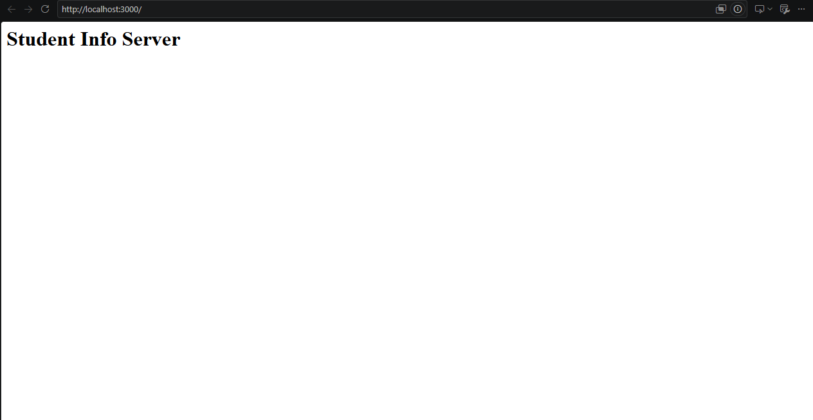
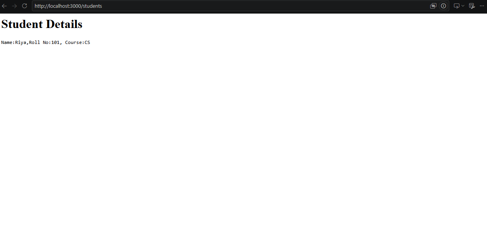
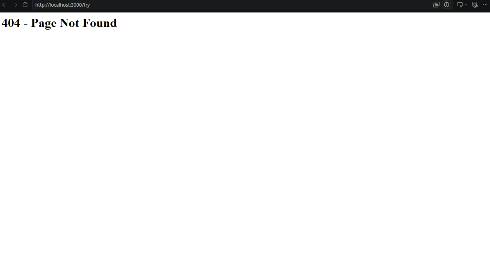
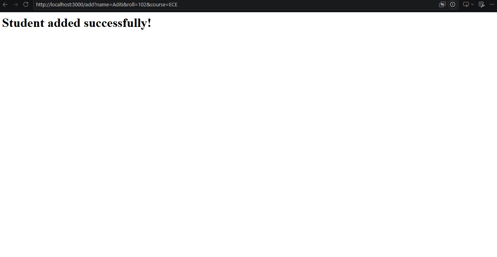
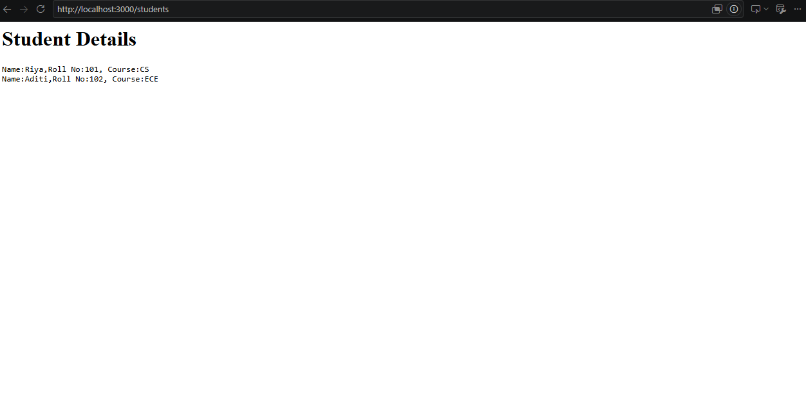

# Week 08 – Student Information Web Server Using Node.js

## 1. Exercise
Develop and implement a simple Student Information Web Server using the built-in `http`, `fs`, and `url` modules. The server runs on port 3000, displays a welcome message, reads and displays student details, allows new student records to be added using URL query parameters, and handles invalid routes using a 404 status code.

## 2. Concepts
• Node.js HTTP server  
• Routing using request URLs  
• File handling using `fs`  
• Reading and appending student records  
• URL parsing using `url`  
• Query parameters  
• HTTP status codes and error handling  
• Student information management  

## 3. Project Structure

```text
WebTechnologyLaboratoryAssignment/
├── studentServer.js       # Node.js HTTP server
├── students.txt           # Stores student records
└── assets/                # Screenshots
```

## 4. Screenshots





