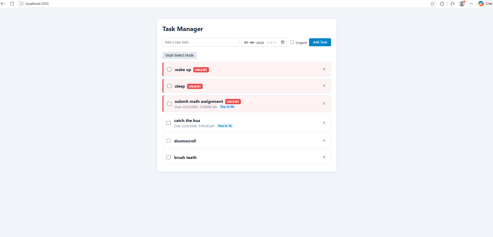
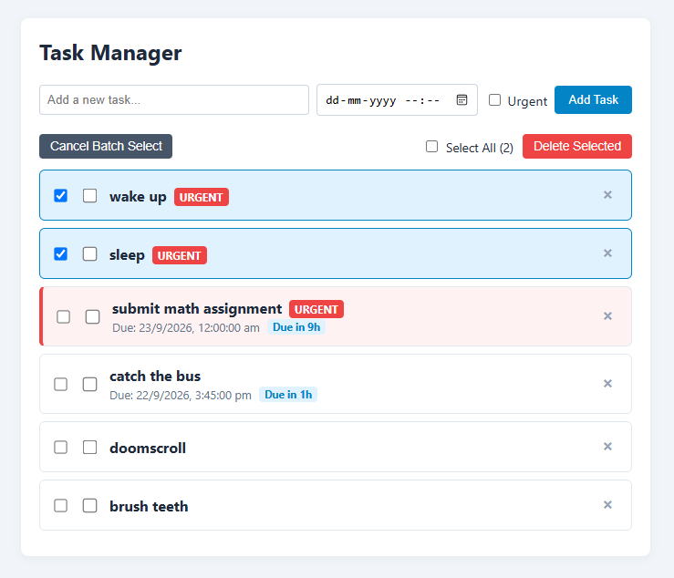

# MERN Stack Task Manager Application

## 1. Exercise

Implement a full-stack MERN (MongoDB, Express.js, React, Node.js) application by connecting a React frontend to an Express and MongoDB backend. The application features persistent task management, including creating tasks with deadlines and priority levels, tracking time remaining, toggling task completion, inline item deletion, and multi-select batch operations.

## 2. Concepts

- React class components and state management
- React lifecycle methods (`componentDidMount`)
- Axios for client-server HTTP communication
- Node.js and Express RESTful API endpoints
- MongoDB database integration using Mongoose schemas and models
- CRUD operations and batch processing

## 3. Key Features
- Priority-Driven Auto-Sorting: Automatically prioritizes urgent tasks at the top of the list with distinct visual accents.
- Real-Time Deadline Tracker: Calculates and displays remaining time or highlights overdue durations dynamically.
- Flexible Deletion Modes: Supports instant single-item removal alongside a toggleable multi-select mode for bulk batch deletion.

## 4. Project Structure

```text
├── client/                 # React Frontend
│   ├── public/
│       └── index.html         
│   └── src/
|       ├── index.js
│       └── App.js          # Main Task Manager component
├── server/                 # Express & MongoDB Backend
│   └── server.js           # Server setup, schema, and API routes
└── assets/                 # Documentation Screenshots

```

## 5. Screenshots


